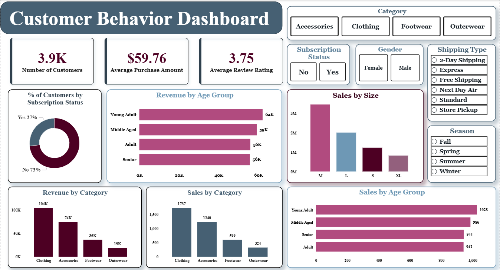

# Customer Behavior Analysis Project

This project represents a complete and end-to-end data analytics workflow designed to mirror the real responsibilities of professional data analysts in modern business environments. The project encompasses all critical stages of data analysis — from data preparation and exploratory analysis to business insight generation, SQL querying and interactive dashboard building.

---

## Project Overview

The goal of this project is to analyze customer shopping behavior from a retail dataset and translate raw data into strategic business intelligence by:

**Data Preparation & EDA (Python):** Clean and transform the raw dataset, engineer new features and explore patterns through visualizations.

**Data Analysis (SQL):** Run 10 business-driven queries to extract insights on customer segments, loyalty, revenue drivers and discount behavior.

**Visualization & Insights (Power BI):** Build an interactive dashboard that highlights key trends and patterns, enabling stakeholders to make data-driven decisions.

---

## Project Structure

```
customer-behavior-analysis/
│
├── data/
│   └── customer_shopping_behavior.csv          # Raw dataset (3,900 rows, 18 columns)
│
├── notebooks/
│   └── Customer_Shopping_Behavior_Analysis.ipynb   # EDA & data preprocessing
│
├── sql/
│   └── Customer_Behavior_Analysis.sql          # 10 business analysis queries
│
├── dashboard/
│   ├── customer_behavior_dashboard.pbix        # Power BI dashboard file
│   └── dashboard_preview.png                  # Dashboard screenshot
│
└── README.md
```

---

## Dashboard Preview



---

## Project Workflow

```
Raw CSV Dataset
      │
      ▼
Python — EDA & Data Cleaning
   • Handle missing values
   • Standardize column names
   • Feature engineering: age_group, purchase_frequency_days
   • Remove redundant columns
      │
      ▼
MySQL — Business Analysis
   • Load cleaned data via SQLAlchemy
   • Run 10 analytical SQL queries
      │
      ▼
Power BI — Interactive Dashboard
   • 7 interactive visuals
   • Slicers: Category, Gender, Subscription, Shipping Type, Season
```

---

## SQL Queries Covered

| # | Business Question |
|---|-------------------|
| Q1 | Total revenue generated by male vs. female customers |
| Q2 | Customers who used a discount but still spent above average |
| Q3 | Top 5 products with the highest average review rating |
| Q4 | Average purchase amount: Express vs. Standard shipping |
| Q5 | Do subscribers spend more? Avg spend & total revenue comparison |
| Q6 | Top 5 products with the highest discount usage rate |
| Q7 | Customer segmentation: New / Returning / Loyal |
| Q8 | Top 3 most purchased products per category (Window Function) |
| Q9 | Are repeat buyers (5+ purchases) more likely to subscribe? |
| Q10 | Revenue contribution by age group |

---

## Key Insights

- **Clothing dominates revenue** — $104K out of $233K total (45%), followed by Accessories at $74K
- **Young Adults generate the most revenue** ($62K) despite similar purchase counts across all age groups
- **Medium size accounts for 46% of all sales** — inventory planning should heavily prioritize M and L sizes
- **Subscribers don't necessarily spend more** — avg spend is nearly identical ($59.49 vs $59.87), suggesting subscription discounts offset loyalty
- **Shipping preference is evenly spread** across all 6 types, indicating customers choose based on cost and urgency
- **73% of customers are not subscribed** — a significant untapped opportunity for conversion and retention campaigns

---

## Tech Stack

| Tool | Purpose |
|------|---------|
| Python (pandas) | Data cleaning, EDA, feature engineering |
| MySQL | Business analysis queries |
| Power BI | Interactive dashboard |
| SQLAlchemy | Python to MySQL data loading |

---

### Let's Connect

LinkedIn: [Purvi Dawra](https://www.linkedin.com/in/purvi-dawra/)

GitHub: [purvidawra](https://github.com/purvidawra)

---

*Thanks for checking out the project! If you found it helpful, feel free to star ⭐ the repo — it means a lot! 🚀*
